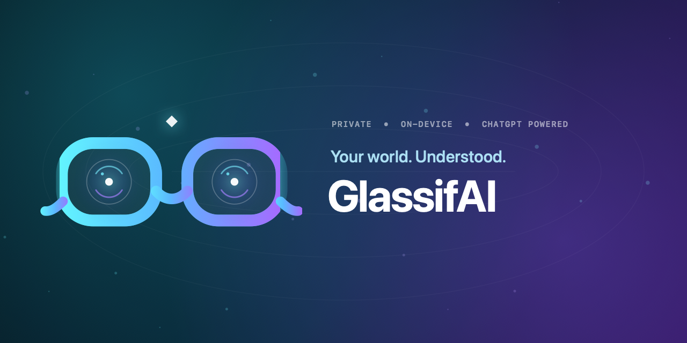
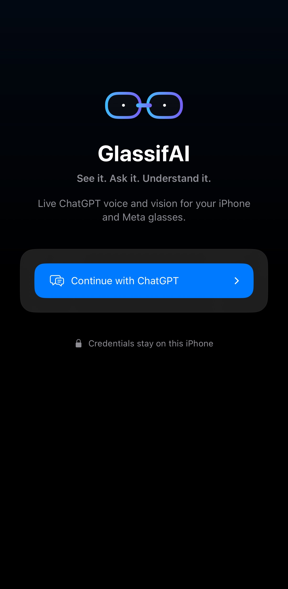
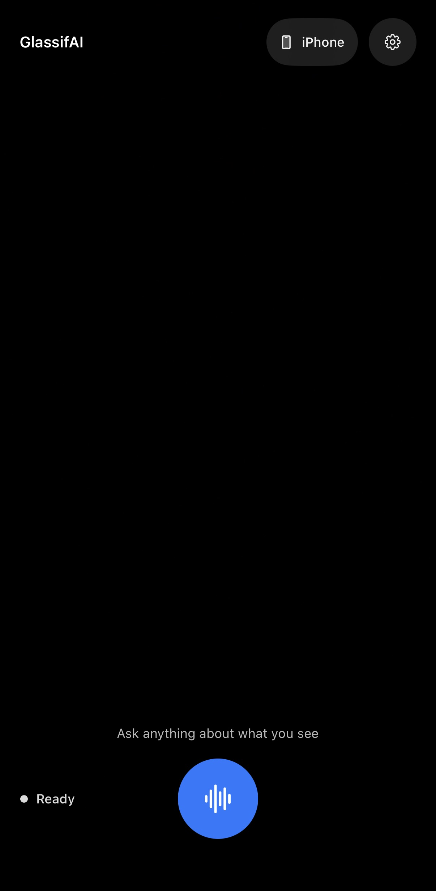

<p align="center">
  
</p>

<p align="center">
  <a href="https://github.com/iannellomarco/GlassifAI/stargazers"></a>
  <a href="LICENSE"></a>
  
  
</p>

<p align="center"><strong>Live ChatGPT voice and visual understanding for iPhone and Meta glasses.</strong></p>

GlassifAI sees through your iPhone or Ray-Ban Meta camera, listens through a native low-latency voice session, and answers using your existing ChatGPT plan. The complete runtime lives on the iPhone: no Mac companion, hosted gateway, shared account, or OpenAI API key.

<p align="center">
  
  
</p>

## Why it is different

- **Talk naturally** — native, interruptible WebRTC voice with spoken responses.
- **Ask about the world** — “What am I looking at?”, signs, screens, objects, colors, and documents.
- **Use the camera you want** — switch between the iPhone and connected Meta glasses.
- **One clean login** — OpenAI’s device-code flow; no embedded web-session workaround.
- **Private by design** — credentials use `ThisDeviceOnly` Keychain protection and camera frames stay memory-only.
- **Actually iPhone-only** — a pinned Codex Rust client is compiled into the app as an XCFramework.

## Architecture

```text
┌────────────────────────────── iPhone ──────────────────────────────┐
│                                                                    │
│  iPhone camera ─┐                     ┌─ ChatGPT live voice         │
│                  ├─ GlassifAI ─ WebRTC ┤                            │
│  Meta glasses ──┘       │             └─ authenticated sideband    │
│                          │                         │                 │
│                          └─ memory-only JPEG ─ Codex Responses      │
│                                                                    │
│  Keychain: device OAuth + refresh token                            │
└────────────────────────────────────────────────────────────────────┘
```

The embedded bridge uses pinned OpenAI Codex `0.149` realtime primitives. Swift owns camera capture, WebRTC media, interface state, and visual analysis; Rust owns authenticated call creation and the realtime sideband protocol.

## Documentation

- [Architecture](docs/ARCHITECTURE.md) — components, data flow, concurrency, voice, and visual delegation.
- [Building](docs/BUILDING.md) — native bridge reproduction, Xcode signing, installation, screenshots, and troubleshooting.
- [Login with ChatGPT](docs/AUTHENTICATION.md) — device authorization, refresh, Keychain storage, and model discovery.
- [Security and privacy model](docs/SECURITY-MODEL.md) — trust boundaries, data inventory, logging rules, and repository hygiene.
- [Porting Codex to iOS](docs/CODEX-IOS-PORT.md) — the complete technical story behind the embedded Rust realtime bridge.

## Requirements

- iPhone running iOS 17 or newer
- Xcode 27 beta for the verified development setup
- Rust stable with iOS targets (only when rebuilding the embedded bridge)
- ChatGPT account with eligible Codex and voice access
- Meta glasses are optional; iPhone camera mode supports the full voice-and-vision flow

## Build

```bash
git clone https://github.com/iannellomarco/GlassifAI.git
cd GlassifAI

# Build the embedded Codex XCFramework. This is generated and not committed.
DEVELOPER_DIR=/Applications/Xcode-beta.app/Contents/Developer \
  ./scripts/build-native.sh

# Build the signed iPhone app.
DEVELOPER_DIR=/Applications/Xcode-beta.app/Contents/Developer \
  xcodebuild -project ios/GlassifAI.xcodeproj \
  -scheme GlassifAI \
  -destination generic/platform=iOS \
  -configuration Debug \
  -allowProvisioningUpdates build
```

Open `ios/GlassifAI.xcodeproj` to select your signing team and run from Xcode. The bundle identifier is `com.marcoiannello.GlassifAI`; change it if your signing account requires a unique identifier.

## First run

1. Tap **Continue with ChatGPT**.
2. Complete OpenAI’s device-code verification in the browser.
3. Choose **iPhone** or **Glasses** as the vision source.
4. Tap the waveform and speak.
5. Ask “What am I looking at?” or “Cosa sto guardando?”

For Meta glasses, enable Developer Mode in Meta AI and ensure the Wearables Developer Center callback scheme matches `glassifai://`.

## Repository layout

```text
ios/       SwiftUI app, Meta DAT integration, and generated framework location
native/    Minimal Rust-to-C bridge compiled for iOS
vendor/    Pinned, patched Codex source required to reproduce the bridge
scripts/   Reproducible native build tooling
assets/    GlassifAI brand and repository artwork
```

The repository intentionally excludes the original VisionClaw gateway, Android experiment, Gemini/OpenClaw paths, hosted agents, deployment manifests, and generated build caches.

## Security

- OAuth credentials are stored with `kSecAttrAccessibleAfterFirstUnlockThisDeviceOnly`.
- Tokens and camera images are never written to GlassifAI logs.
- Visual frames are bounded JPEGs held in memory and sent only for visual questions.
- Disconnecting removes the local ChatGPT session.
- There is no TLS bypass, credential pooling, analytics SDK, or GlassifAI-controlled backend.

## Important compatibility note

ChatGPT’s subscription-backed realtime transport is private and unsupported. It may change without notice. GlassifAI pins the known-good Codex implementation so protocol behavior is auditable and reproducible, but upstream entitlement or protocol changes can still require an update.

## License

Original GlassifAI code and branding are available under the [MIT License](LICENSE), copyright © 2026 Marco Iannello. Meta sample code, OpenAI Codex, LiveKit WebRTC, and other dependencies retain their respective terms; see [Third-party notices](THIRD_PARTY_NOTICES.md).

<p align="center">Built by <a href="https://github.com/iannellomarco">Marco Iannello</a>.</p>
